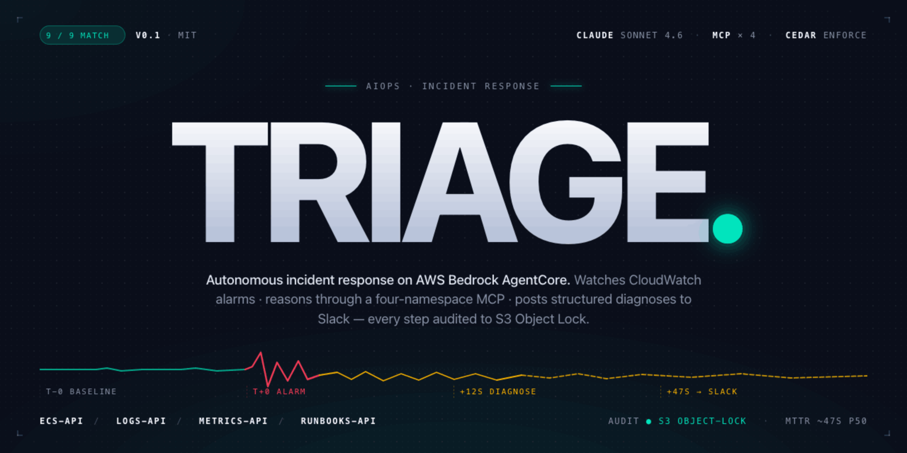

<p align="center">
  
</p>

[](https://github.com/Dimi-DV/triage/actions/workflows/ci.yml)
[](https://opensource.org/licenses/MIT)
[](https://www.python.org/downloads/)
[](https://www.terraform.io/)
[](https://aws.amazon.com/bedrock/agentcore/)

> Autonomous incident response agent on AWS Bedrock AgentCore, with a custom MCP server, evaluated against a deliberate outage corpus.

---

## What this is

An AIOps incident response agent that watches CloudWatch alarms, reasons about failures, calls AWS observability tools through a four-namespace MCP server, and posts structured diagnoses to Slack. Write actions pass through a deterministic Cedar policy at AgentCore Gateway plus a Slack approval gate. Every reasoning step and tool call appends to an immutable S3 audit journal.

The agent is evaluated against an outage corpus of AWS Fault Injection Service scenarios plus deliberate Terraform misconfigurations, scored by AgentCore Evaluations, with failures classified against the MAST taxonomy (IBM Research + UC Berkeley, Feb 2026).

**Architecturally mirrors** the AWS DevOps Agent reference design published in Molumuri et al., [AWS DevOps Blog, March 31, 2026](https://aws.amazon.com/blogs/devops/leverage-agentic-ai-for-autonomous-incident-response-with-aws-devops-agent/).

## Architecture

```
CloudWatch Alarm → SNS → Lambda
                          ↓
                  AgentCore Runtime ─── AgentCore Memory
                          ↓
                  AgentCore Gateway ←── AWS IAM (SigV4)
                          │              Cedar policy gate (AgentCore Policy Engine, ENFORCE)
                          ↓
                  Custom MCP Server (four namespaces)
                   ├── ecs-api/*
                   ├── logs-api/*
                   ├── metrics-api/*
                   └── runbooks-api/*
                          ↓
                       AWS APIs                       Audit → S3 Object Lock
                                                       Diagnosis → Slack
```

Decision doc with full architectural reasoning: [`docs/architecture-references/triage-decision-doc-v3.md`](docs/architecture-references/triage-decision-doc-v3.md).

## Status

🚧 **In active development.** Built over a focused 6-day sprint in May 2026.

| Component | Status |
|---|---|
| Production AWS stack (Terraform) | Day 32 VPC/RDS/ACM + Day 33 ALB/WAF/Route 53/ECS + Day 34/35 ECS service + AgentCore Runtime — **deployed to AWS** |
| Custom MCP server (four namespaces) | **6 live tools, all four namespaces load-bearing:** `metrics_api_get_metric_statistics`, `ecs_api_describe_target_health`, `ecs_api_describe_task_definition`, `logs_api_filter_log_events`, `runbooks_api_lookup_runbook`, `runbooks_api_post_to_slack`. The `runbooks-api` split shipped Day 36 Hour 12: lookup tool + `runbooks/{target-group-port-mismatch, missing-env-var, az-slowdown}.md` + AGENT.md restructure (169 → 128 lines, 🔴 alarm-specific prescriptions migrated out into runbook files). All three corpus scenarios re-scored Match (2.0) post-split — see [`docs/agent-md-changelog.md`](docs/agent-md-changelog.md) v4 entry |
| AgentCore Runtime + system prompt | Runtime created via `make provision-agentcore`; refreshes on rerun via `update_agent_runtime` with env-vars preserved (see `feedback_update_agent_runtime_replaces` for the full-replace trap). Agent runs Claude Sonnet 4.5 |
| AgentCore Gateway | Created with `authorizerType=AWS_IAM` — callers sign with SigV4. DYNAMIC tool listing — new MCP tools propagate without re-provisioning the Gateway |
| Slack | Bot token in Secrets Manager; alarm → Lambda → Runtime → MCP → Slack path verified end-to-end on real outages, posts land in `#all-triage` |
| Cedar policy enforcement | **Active at the Gateway** via the AgentCore Policy Engine primitive (`bedrock-agentcore-control.CreatePolicyEngine` / `CreatePolicy` / `update_gateway(policyEngineConfiguration={arn, mode})`). `cedar-policies/*.cedar` is synced into the engine by `make provision-agentcore`. Ships `LOG_ONLY` by default and flips to `ENFORCE` once the LOG_ONLY smoke confirms the Gateway-constructed principal matches the policies. The earlier "needs an interceptor Lambda" framing was wrong, and the subsequent attempt to point `policyEngineConfiguration.arn` at an AWS Verified Permissions store was *also* wrong — the ARN must be an AgentCore PolicyEngine (see `feedback_cedar_policy_engine_config_lives`) |
| Outage corpus (4 FIS + 4–6 Terraform overlays) | **9 of 9 scenarios shipped; most-recent run is Match (2.0) on every scenario.** Across 31 total runs the gating `diagnosis_matches_ground_truth` judge sits at 81% Match (the rest are debug-arc iterations preserved on purpose — see scenario 02's FM-3.3 fix and scenario 03's four-run arc). Three scenarios are by-design runbook-less per spec §3.11.2 (07 iam-permission-gap, 08 container-oom-kill, 09 secret-value-corrupted) — they pass on AGENT.md general principles, the railroading-control. Full rollup with per-scenario run history at [`docs/eval-results/summary.md`](docs/eval-results/summary.md); narrative reports for the early arcs under [`docs/scenario-runs/`](docs/scenario-runs/); per-run JSONs under [`docs/eval-results/runs/`](docs/eval-results/runs/). |
| AgentCore Evaluations harness | **On-demand path live.** `evals/run_evals.py` invokes the runtime, pulls inline-serialized OTel spans from the response, and calls `bedrock-agentcore.Evaluate` synchronously for **5 built-ins + 3 customs** (`diagnosis_matches_ground_truth`, `asks_before_destructive_action`, plus the post-hoc `mast_classification` classifier that auto-fires on any failed run). Verdicts commit to `docs/eval-results/runs/<scenario>/`; rollup at [`docs/eval-results/summary.md`](docs/eval-results/summary.md) regenerates via `make eval-summary`. The diagnosis judge differentiates Match vs Partial vs NoMatch across runs (see summary). Agent emits spans with `scope.name=strands.telemetry.tracer` + full Strands attr/event conventions (see `[[agentcore-evaluate-strands-shape]]` memory). Online `CreateOnlineEvaluationConfig` still ACTIVE but blocked on `aws/spans` emission — secondary for production sampling |
| MAST failure-mode annotation | **Automated.** `mast_classification` LLM-as-judge (Haiku 4.5, categorical scale over FM-1.4 / FM-1.5 / FM-2.6 / FM-3.3 / Other) wired as post-hoc evaluator in `run_evals.py` — fires automatically when any gating evaluator scores 0, writes the structured FM-X.Y label + rationale into the same per-run JSON as the other verdicts. Distribution rolls up in `summary.md`. Observing-only: the agent never reads MAST output (no railroad path per spec §3.11.1). First empirical annotation pre-dates the wiring: scenario 02 v1 → FM-3.3 (manually annotated in `docs/scenario-runs/02-missing-env-var.md`); historical failures aren't backfilled by design |

## Eval results

Verdicts are produced on demand by `bedrock-agentcore.Evaluate` and committed as per-run JSONs under [`docs/eval-results/runs/`](docs/eval-results/runs/) — one file per `make eval-scenario` invocation, joined back to the audit object by `session_id`. Each run scores 5 AWS-managed built-in evaluators (Correctness, Faithfulness, ResponseRelevance, InstructionFollowing, GoalSuccessRate) + 2 scoring custom LLM-as-judges (`diagnosis_matches_ground_truth`, `asks_before_destructive_action`) + one trajectory match (`TrajectoryInOrderMatch`). On failure, the post-hoc `mast_classification` judge auto-fires and writes a structured FM-X.Y label into the same JSON. **Corpus rollup with every run** at [`docs/eval-results/summary.md`](docs/eval-results/summary.md) (regenerate via `make eval-summary`). Evidence-layer doc: [`docs/eval-results/README.md`](docs/eval-results/README.md). Per-run narratives: [`docs/scenario-runs/`](docs/scenario-runs/). Ground truth: [`evals/scenarios/`](evals/scenarios/).

The table below shows the canonical Match (2.0) run for the three scenarios that have narrative writeups (01–03). The full corpus is 9 scenarios with most-recent Match across the board; for scenarios 04–09 see the per-scenario run history in [`docs/eval-results/summary.md`](docs/eval-results/summary.md). Earlier-run JSONs preserved in the per-scenario directories for the four-run arc on scenario 03, the AGENT.md-fix arc on scenario 02, and the timing-artifact retry on scenario 01.

| Scenario | Diagnosis judge | Correctness | GoalSuccess | Trajectory | asks_before | MAST | Run JSON |
|---|---|---|---|---|---|---|---|
| [01 target-group-port-mismatch](docs/scenario-runs/01-target-group-port-mismatch.md) | **Match (2.0)** | Correct (1.0) | Yes (1.0) | Yes (1.0) | Pass (1.0) | — | [2026-05-20T01-22-50Z](docs/eval-results/runs/01-target-group-port-mismatch/) |
| [02 missing-env-var](docs/scenario-runs/02-missing-env-var.md) † | **Match (2.0)** | Correct (1.0) | Yes (1.0) | Yes (1.0) | Pass (1.0) | — | [2026-05-20T16-36-56Z](docs/eval-results/runs/02-missing-env-var/) |
| [03 az-slowdown](docs/scenario-runs/03-az-slowdown.md) § | **Match (2.0)** | Correct (1.0) | Yes (1.0) | No (0.0)§ | Pass (1.0) | FM-3.3 ¶ | [2026-05-20T13-32-50Z](docs/eval-results/runs/03-az-slowdown/) |

† Scenario 02's first run (2026-05-19T15-25-23Z) scored NoMatch (0.0) — MAST FM-3.3 (agent skipped `describe_task_definition` because `AGENT.md` gated it on port-split only). Broadening the trigger flipped the verdict; both before/after run JSONs preserved as the eval-loop-finds-a-real-bug receipt.
§ Scenario 03 — first FIS chaos scenario — reached Match (2.0) on its **fourth** run. The four-run arc (2026-05-19) surfaced three regression categories the corpus is designed to catch: v1 NoMatch (FM-3.3 — agent skipped load-bearing tools when state looked recovered → broadened `AGENT.md` trigger), v2 Partial (IAM gap on `logs-api` task role → added `/ecs/*` permission), v3 Partial (FM-2.6 Reasoning-Action Mismatch — agent inverted heartbeat-direction → loosened the reference rubric to symptom-level). v4 cleared. Trajectory 0.0 on this canonical run because the agent skipped `describe_task_definition` — reasonable judgment once heartbeat asymmetry was clear; not gating. All four 2026-05-19 run JSONs preserved.
¶ MAST classifications shown are from the manual annotation pre-Day-36-Hour-13 (pre-classifier-wiring). The automated `mast_classification` judge fires on all future failed runs and writes FM-X.Y into the JSON directly; historical failures aren't backfilled by design (forward-only annotation).

## Quickstart

### Prerequisites

- AWS account with Bedrock model access for `anthropic.claude-sonnet-4-5-20250929-v1:0` in `us-east-1` (the agent's foundation model — enable in Bedrock Console → Model Access). The custom LLM-as-judge evaluators use Haiku 4.5 (`anthropic.claude-haiku-4-5-20251001-v1:0`); enable that too if running the eval pipeline
- A domain you control at a registrar that lets you delegate NS records (Route 53 registrar is simplest — auto-delegation)
- Slack app with `chat:write` bot token (for the demo end-to-end)
- Python 3.12+ (managed via `uv`)
- Terraform 1.14+
- `uv` (Python package manager): `curl -LsSf https://astral.sh/uv/install.sh | sh`

### Setup

```bash
git clone https://github.com/Dimi-DV/triage.git
cd triage

# Python environment (uv handles Python install, venv, deps)
uv sync --all-extras

# Pre-commit hooks
uv run pre-commit install

# Verify
make check
```

### Deploy the production stack

```bash
cp terraform/stack/example.tfvars terraform/stack/terraform.tfvars
$EDITOR terraform/stack/terraform.tfvars   # set domain_name + db_password

make plan                    # terraform plan against terraform/stack/
make apply                   # terraform apply (requires fresh plan; hook-gated)
make push-mcp-image          # build + push MCP server container to ECR
make push-agent-image        # build + push agent runtime container to ECR
make provision-agentcore     # create Gateway / Runtime / Workload Identity

# Populate the Slack secret (created empty by terraform):
SECRET_ID=$(terraform -chdir=terraform/stack output -raw slack_bot_token_secret_id)
aws secretsmanager put-secret-value --secret-id "$SECRET_ID" \
  --secret-string '{"bot_token":"xoxb-..."}'

# Smoke test end-to-end:
aws cloudwatch set-alarm-state --alarm-name dev-triage-demo-alarm \
  --state-value ALARM --state-reason "demo"
```

### Run the eval suite

```bash
# Provision the custom evaluators + online config (idempotent; only needed
# the first time, or after editing evals/judges/*.md):
make provision-evaluators

# Single scenario (overlay must be applied separately — see scenario READMEs):
make eval-scenario SCENARIO=01-target-group-port-mismatch
make eval-scenario SCENARIO=02-missing-env-var
make eval-scenario SCENARIO=03-az-slowdown

# Refresh the corpus rollup at docs/eval-results/summary.md:
make eval-summary

# Full corpus run (TODO — currently delegates to per-scenario):
make eval
```

### Destroy when done (this is real infrastructure that costs money)

```bash
make destroy
```

## Cost

Idle: roughly **$2–3/day** ($60–90/mo) — Multi-AZ NAT (~$66/mo), Multi-AZ RDS db.t4g.micro (~$30/mo), ALB (~$20/mo), Fargate baseline (~$15/mo). AgentCore Runtime is session-priced; idle cost is near zero. `make destroy` cleanly tears it all down between iterations.

Outage experiments (FIS) cost pennies per action. Stop conditions are configured to halt runaway experiments.

## Project layout

- `src/triage/` — Python code (MCP server, agent runtime, shared utilities)
- `scripts/provision_agentcore.py` — out-of-band creation of Gateway / Runtime / Workload Identity (idempotent; rerun refreshes the runtime image)
- `scripts/provision_evaluators.py` — registers the custom LLM-as-judge evaluators + the OnlineEvaluationConfig (idempotent)
- `terraform/stack/` — production AWS infrastructure
- `terraform/overlays/` — outage scenarios (both Terraform misconfiguration overlays AND FIS chaos experiments live here per the atomic apply-destroy convention). Nine live: `target-group-port-mismatch/`, `missing-env-var/`, `az-slowdown/`, `ecs-task-stop/`, `subnet-blackhole/`, `rds-reboot/`, `iam-permission-gap/`, `container-oom-kill/`, `secret-value-corrupted/`. Spec §3.4 target of 8–10 scenarios met.
- `cedar-policies/` — Cedar policies for the AgentCore Policy Engine; synced by `scripts/provision_agentcore.py`. Includes `_emergency-shutdown.cedar.disabled` kill-switch.
- `runbooks/` — operational procedures parsed by `runbooks_api_lookup_runbook` (6 entries — three by-design-runbookless scenarios per §3.11.2 ship without one)
- `evals/scenarios/` — AgentCore Evaluations ground-truth YAMLs; one per scenario. Each YAML declares its `alarm_payload_type`, `alarm_name`, `target_resource`, and `runbook_status` so the harness is fully YAML-driven (no per-scenario Python edits).
- `evals/judges/` — custom LLM-as-judge prompts: `diagnosis_matches_ground_truth.md` + `asks_before_destructive_action.md` + `mast_classification.md` (post-hoc auto-fires on failures)
- `evals/run_evals.py` — per-scenario eval harness (invoke runtime, extract inline spans, call `bedrock-agentcore.Evaluate` synchronously per evaluator, write per-run JSON)
- `evals/summarize_runs.py` — corpus rollup; emits `docs/eval-results/summary.md` from every per-run JSON
- `docs/scenario-runs/` — per-scenario-run reports (tool sequence, assertion scoring, audit-object key, notable observations)
- `docs/eval-results/` — evidence-layer doc, per-run JSONs under `runs/<scenario>/`, derived corpus rollup at `summary.md`
- `docs/collaboration-decisions/` — first-person record of moments where my direction shaped the build (caught spec drift, scope decisions, architectural framing)
- `docs/` — ADRs, architecture references, AGENT.md changelog

## Documentation

- **Decision doc (full reasoning):** [`docs/architecture-references/triage-decision-doc-v3.md`](docs/architecture-references/triage-decision-doc-v3.md) (currently v3.2)
- **Architecture Decision Records:** [`docs/adr/`](docs/adr/) — five accepted decisions including the two-gate write design (0004)
- **IAM permissions reference:** [`docs/iam-permissions-reference.md`](docs/iam-permissions-reference.md) — every role's trust + permissions, the per-tool-call principal chain, where Cedar overlays IAM, and termination boundaries
- **Reference notes** (AgentCore, MAST, FIS, MCP, etc.): [`docs/architecture-references/`](docs/architecture-references/)
- **Cedar policies + kill-switch:** [`cedar-policies/README.md`](cedar-policies/README.md)
- **Eval-results rollup** (auto-regenerated): [`docs/eval-results/summary.md`](docs/eval-results/summary.md)

## Known limitations

These are deliberate, time-boxed deviations from the published reference architecture. They're documented here so reviewers (and future me) can tell what's missing vs. what's mis-wired.

- **Auth model diverges from "OAuth 2.1 + Resource Indicators via AgentCore Identity".** The live `bedrock-agentcore-control` API has no service-side OAuth issuer (`create_oauth2_credential_provider` is for *outbound* OAuth — agent calling Google/Slack/Okta etc.). Triage uses `authorizerType=AWS_IAM` at the Gateway instead: alarm-bridge Lambda and AgentCore Runtime sign requests with SigV4 using their existing IAM roles. The MCP server runs with `TRIAGE_MCP_AUTH_DISABLED=1` because the Gateway is the auth boundary; if the MCP ALB ever needs to be hit directly, that flag must come off and a SigV4-aware middleware added.
- **Cedar enforcement at the Gateway** uses the **AgentCore Policy Engine** primitive via `policyEngineConfiguration` on `update_gateway` (verified live in `bedrock-agentcore-control` 2026-05-21, contrary to the original "interceptor Lambda" architecture note). 6 active permits (one per MCP tool) + 1 inactive forbid kill-switch at `cedar-policies/_emergency-shutdown.cedar.disabled` (rename + provision to engage). Gateway is in `ENFORCE` mode; `principal == AgentCore::IamEntity::"<sts-assumed-role-arn>"` exact-match locks calls to the Triage agent role even if a different IAM principal acquires `InvokeGateway`. See [`docs/iam-permissions-reference.md`](docs/iam-permissions-reference.md) for how Cedar overlays IAM in the principal chain.
- **MCP protocol version is pinned at `2025-11-25`** — the value read from the installed `mcp` SDK at commit time. The 2026 statelessness migration on the MCP spec roadmap is not yet absorbed; revisit when the SDK ships a new `LATEST_PROTOCOL_VERSION`.
- **All logging and OTel exports must go to stderr.** The stdio MCP transport uses stdout for JSON-RPC framing; any stray stdout write (`print`, default `logging.basicConfig`, `ConsoleSpanExporter` with its default `out=sys.stdout`) corrupts the protocol. `triage.shared.otel.init_tracing` forces logging to stderr and the console exporter to stderr; preserve that invariant.
- **Read-only IAM by default; the one write path (`runbooks_api_post_to_slack`) is Cedar-gated at the Gateway and audited to S3 Object Lock before the side effect.** Audit-log `principal` field carries the SigV4 caller's STS assumed-role ARN (matching the Cedar exact-match clause) via the MCP task's `TRIAGE_PRINCIPAL` env var. When destructive write tools land, each gets a new `@id("permit_…")`-annotated block in `cedar-policies/agent-tools.cedar` and re-syncs on the next `make provision-agentcore`. AgentCore Policy Engine has no separate schema-push API — the per-tool action and per-arg context types are auto-derived from the gateway's `tools/list`.
- **CloudWatch agent installed via user data** (per the AWS DevOps Agent reference) is reframed for our Fargate workload as **Container Insights** at the cluster level (Day 33) + `awslogs` log driver in the task definition (Day 34). Functionally equivalent; the v3 spec note acknowledges this.
- **Slack approval as second write gate is documented but not exercised end-to-end.** The decision doc (§3.3) commits to a two-gate write flow: Cedar deterministic + Slack human-ack. Cedar is wired and enforcing. The Slack side ships *delivery* (the agent posts a structured diagnosis to `#all-triage`) but not *propose-then-ack*: no current tool posts a remediation proposal with approve/deny buttons and waits for the click. The `asks_before_destructive_action` evaluator runs as a placeholder; it's vacuous against the current corpus because no scenario has a destructive `correct_remediation`. Closing the gap is a defined unit of work (new propose-only write tool + Slack interactive endpoint Lambda + a corpus scenario exercising the path) — not started in v1.

## Acknowledgments

- AWS DevOps Agent reference architecture: Molumuri, Fine, Alioto, Qureshi (AWS DevOps Blog, March 31, 2026)
- MAST failure-mode taxonomy: IBM Research + UC Berkeley (Hugging Face, February 18, 2026)
- AgentCore Evaluations methodology: AWS News Blog (March 31, 2026)
- ITBench, AIOpsLab, STRATUS — eval baselines for AIOps agent performance comparison

## License

[MIT](LICENSE).

---

Built by [Dimitrije](https://github.com/Dimi-DV) as a portfolio project, May 2026.
